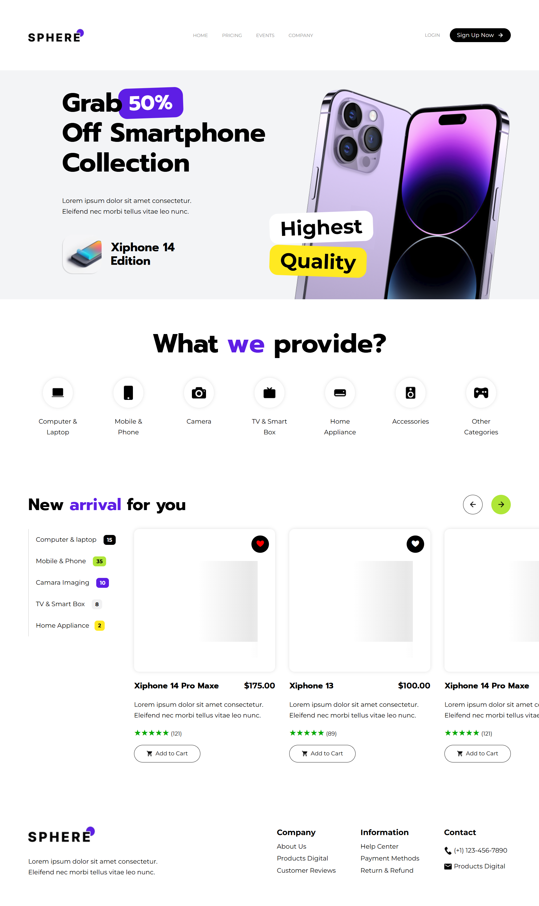
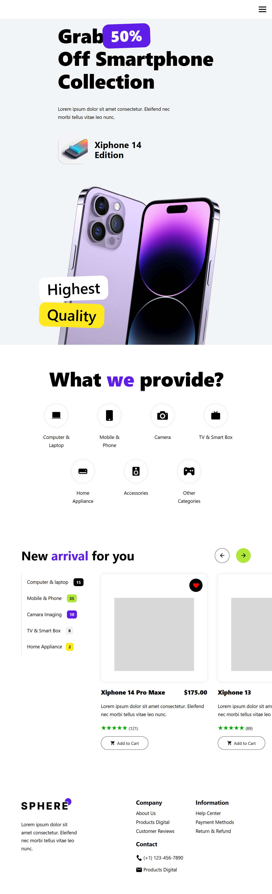
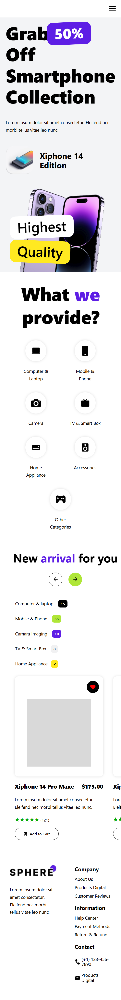

# Prueba-B-Life: Electronic Ecommerce Landing Page

## Descripción general

Este es el resultado de la prueba técnica realiza para la vacante Vacante de Programador FrontEnd para la empresa B Life, en donde aplique mis conocimientos, como flex-box, Grid Layout, metodología B.E.M para estilos CSS organizados, transiciones, animaciones, buena maquitación, etc. Separado todo en componentes para la escalabilidad, todo con React.

## Vistas previas del diseño responsivo del proyecto

### Vistas diseño para PC min-width 1024px

### Vistas diseño para tablets min-width 768px y max-width 1024px

### Vistas diseño para dispositivos móviles max-width 768px

## Nota

Toda la página web fue diseñado, en base a los documentos proporcionados, para la realicación de la prueba, a falta de información se intento cumblir el diseño y funcionalidades faltantes, para desarrollar la prueba lo más completa posible en el menor tiempo posible.

- [Enlace al proyecto en Figma utilizado para diseño de la web.](https://www.figma.com/design/tjfZORsYzTtZcYfW1xX3UM/Prueba-B-Life?node-id=959-392&t=HJ3Zki9ea3ri5QBZ-0)

Para ver el resultado del proyecto final, da click al siguiente enlace.

- [Enlace al citio web.](https://Frank345-sys.github.io/Prueba-B-Life/)

## Autor

Francisco Omar Habib González Utrera Agosto 2024
